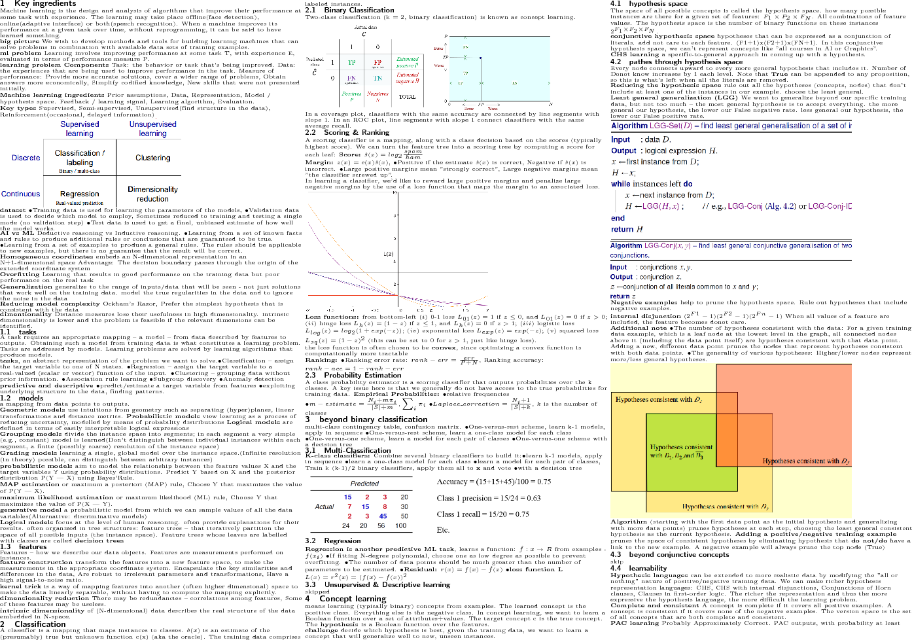

# awesome cheat sheet
### TODO
- [ ] Key ingredients
- [ ] Classification
- [ ] Concept learning
- [ ] Decision trees
- [ ] Linear models
- [x] Distance-based models
- [x] Probabilistic models
- [x] Features
- [x] Model ensembles
- [x] ML experiments
- [x] Neural network  

###### page 1
  
###### page 2

  
https://www.overleaf.com/5393382kxvnbh#/17211853/
